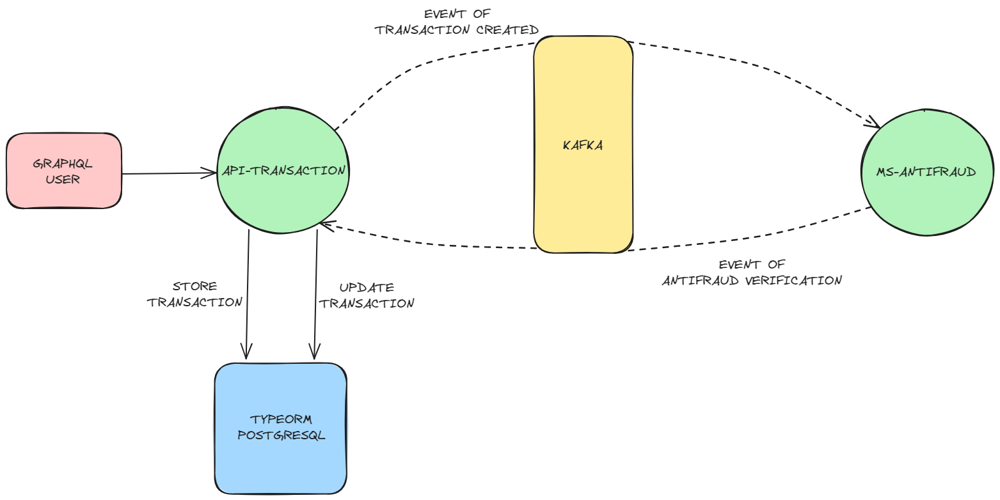

# Yape Code Challenge 🚀

If you want to see the challenge, click [here](CHALLENGE.md "Go to Challenge Section").

- [Solution](#solution "Go to Solution Section")
- [Tech Stack](#tech-stack "Go to Tech Stack Section")
- [Getting Started](#getting-started "Go to Getting Started Section")
  - [Prerequisites](#prerequisites "Go to Prerequisites Section")
  - [Running the project in development mode](#running-the-project-in-development-mode "Go to Running the project in development mode Section")
  - [Running the project in production mode](#running-the-project-in-production-mode "Go to Running the project in production mode Section")
- [Stress Test](#stress-test "Go to Stress Test Section")
- [Documentation](#documentation "Go to Documentation Section")
- [Final Notes](#final-notes "Go to Final Notes Section")

## Solution

This service is built using **NestJS** and follows a **hexagonal architecture**, separating the core application logic from infrastructure concerns.

- **Api Transaction:** Service that allow handle transactions.
- **Ms Antifraud:** Microservice that allow verify if a new transaction is valid or not.



## Tech Stack

- **NestJS (NodeJS):** Framework for server-side applications.
- **TypeOrm (PostgreSQL):** ORM for TypeScript and JavaScript
- **Apache Kafka:** Distributed data streaming platform.
- **GraphQL:** Query language for APIs.
- **Docker:** Platform for creating, deploying, and running applications in containers.
- **Apollo GraphQL:** A comprehensive platform for managing and consuming GraphQL APIs.
- **k6:** Used for load testing and performance monitoring of APIs and web applications

## Getting Started

### Prerequisites

-   Docker
-   Docker Compose

### Running the project in development mode

1. Clone this repository to your local machine.
2. Rename all `.env.example` files to `.env`.
3. Navigate to the root of the project where the `docker-compose.local.yml` file is located.
4. Run the following command to start the backend and frontend services:

```bash
docker-compose -f docker-compose.local.yml up --build -d
```

This will create and start Docker containers with each microservice, database, queue and dependencies running simultaneously.

5. Once all the containers are up and running, you can access the application through the following link:

* **Backend (NestJS):** `http://localhost:3000/graphql`

This will display a Apollo Studio to prove the exposed apis with GraphQL.

### Running the project in production mode

1. Clone this repository to your local machine.
2. Rename all `.env.example` files to `.env`.
3. Navigate to the root of the project where the `docker-compose.prod.yml` file is located.
4. Run the following command to start the backend and frontend services:

```bash
docker-compose -f docker-compose.prod.yml up --build -d
```

This will create and start Docker containers with each microservice, database, queue and dependencies running simultaneously.

5. Once all the containers are up and running, you can access the application through the following link:

* **Backend (NestJS):** `http://localhost:3000/graphql`

This will display a Apollo Studio to prove the exposed apis with GraphQL.

## Stress Test

The stress tests are in k6, which allows us to write test scripts in JavaScript and execute them to simulate thousands of concurrent users interacting with the system. 
In adition, each project has `100% code coverage`, ensuring that all critical paths and functionalities are tested.

To run the stress test use the following commands:

- **Get Transactions:** To run the stress test for retrieving transactions, use the following command:

```bash
docker-compose -f docker-compose.prod.yml k6 run --out json=report.json scripts/get_transactions.k6.js
```

- **Create Transaction:** To run the stress test for creating transactions, use the following command:

```bash
docker-compose -f docker-compose.prod.yml k6 run --out json=report.json scripts/create_transaction.k6.js
```

Each command will generate a report in the `k6/report.json` file

### Using the Service (development mode)

You can interact with the service using the Swagger documentation interface (available at `http://localhost:3000/docs`) or tools like Postman.

For developers who wish to explore, modify, or debug the service, you can also leverage **Development Containers (Dev Containers)**. This setup provides a consistent and isolated development environment within the Docker containers defined in this project. Using tools that support Dev Containers (such as VS Code with the Remote - Containers extension), you can directly connect to the running service container and work on the codebase with all necessary dependencies and configurations already set up.

## Documentation

The backend (NestJS) is documented using Apollo GraphQL, which provides an interactive interface to explore and test GraphQL endpoints. You can access the documentation at the following link:

* **Documentation (Apollo GraphQL):** `http://localhost:3000/graphql`

The Apollo GraphQL generated documentation will show you the different schemas, queries and mutations available in the backend along with details about the required parameters, and responses.

### 1. Querying All Transactions

This query allows you to retrieve a list of all transactions, along with details such as their external ID, type, status, value, and creation timestamp.

**Query:**

```graphql
query Transactions {
  transactions {
    transactionExternalId
    transactionType {
      name
    }
    transactionStatus {
      name
    }
    value
    createdAt
  }
}
```

### 2. Querying a Single Transaction by ID

This query allows you to retrieve a specific transaction by its external ID, providing details such as the transaction type, status, value, and creation timestamp.


**Query:**

```graphql
query Query($transactionId: ID!) {
  transaction(id: $transactionId) {
    transactionExternalId
    transactionType {
      name
    }
    transactionStatus {
      name
    }
    value
    createdAt
  }
}
```

**Variables:**

```json
{
  "transactionId": "fa9c9fd7-da7d-4210-8cd7-4f214057d70d"
}
```

### 3. Creating a New Transaction

This mutation allows you to create a new transaction by providing the debit account, credit account, transfer type, and the transaction value.


**Mutation:**

```graphql
mutation Mutation($createTransactionInput: CreateTransactionInput!) {
  createTransaction(createTransactionInput: $createTransactionInput) {
    id
    createdAt
    updatedAt
    deletedAt
    accountExternalIdDebit
    accountExternalIdCredit
    tranferTypeId
    transactionStatus
    value
  }
}
```

**Variables:**

```json
{
  "createTransactionInput": {
    "accountExternalIdCredit": "e2fa47d6-1dc8-4ef4-91f2-390686e17821",
    "accountExternalIdDebit": "017f2db9-2cdc-488c-a74e-db28cbe1786c",
    "tranferTypeId": 1,
    "value": 300
  }
}
```


### 4. Updating an Existing Transaction

This mutation allows you to update specific fields of an existing transaction, identified by its id. In this example, only the value field is being updated.


**Mutation:**

```graphql
mutation Mutation($updateTransactionId: ID!, $updateTransactionInput: UpdateTransactionInput!) {
  updateTransaction(id: $updateTransactionId, updateTransactionInput: $updateTransactionInput) {
    transactionExternalId
    transactionType {
      name
    }
    transactionStatus {
      name
    }
    value
    createdAt
  }
}
```

**Variables:**

```json
{
  "updateTransactionId": "fcf67dc5-4ec0-4d08-b1d7-3a6333f1f877",
  "updateTransactionInput": {
    "value": 300
  }
}
```


## Final Notes
   This solution provides a robust foundation for an antifraud service, emphasizing performance, scalability, and reliability. The hexagonal architecture and comprehensive testing contribute to a maintainable and dependable system.
   
   Thank you for the opportunity to analyze and extend this excellent piece of work!